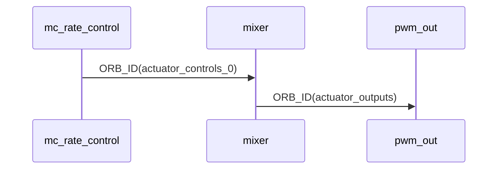
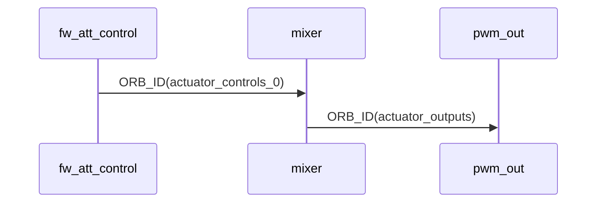
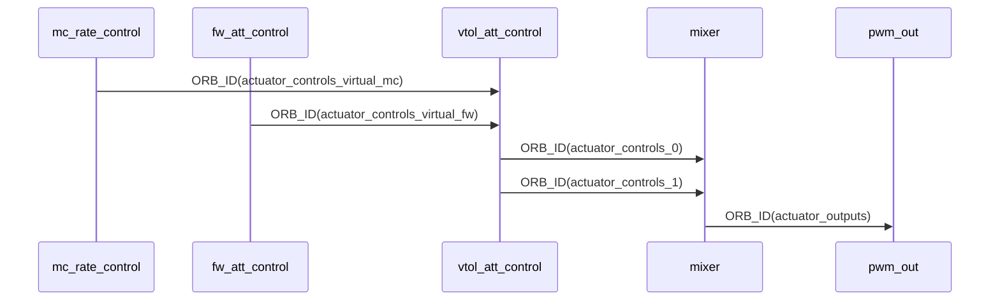
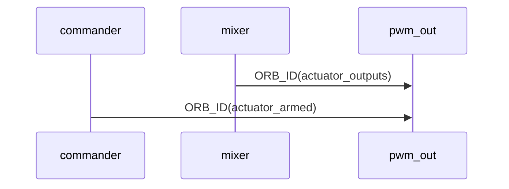

# 混控器

经过位置控制和姿态控制后，控制量通过 actuator_controls发布，其中 control 数组存放了四个的控制量即：(roll, yaw, pitch , throttle) 。这四个量投影到不同的轴臂上，投影关系即是混控矩阵。

> 换句话说，混控确定了飞机的控制输出（`yaw`, `roll`, `pitch`）映射到飞机各个 `PWM` 通道输出的关系

## mixer

输入：ORB_ID(actuator_controls_0)，8路归一化控制量

输出：ORB_ID(actuator_outputs)，16路PWM值，在[1000,2000]范围

### 四组控制通道

控制通道输出主要有4组 Control Group，

- actuator_controls_0：飞控的主要控制通道，用于输出俯仰、滚转、偏航、油门等各个通道的控制量
- actuator_controls_1：备用控制通道，在VTOL中用于输出固定翼模式的控制输出
- actuator_controls_2：云台控制通道
- actuator_controls_3：遥控映射通道


### ORB消息流程

对于多旋翼构型无人机，ORB流图如下：



对于固定翼构型无人机，ORB流图如下：




对于垂起构型无人机，ORB消息流图如下所示：



## 创建mixer

### 定义

​		在apps\controller\airframe定义了很多机架，每个机架都包括了一个_mixer[]数组变量，该数组变量就定义了混控器的结构。

​		在该数组中，创建了N个混控器，每个混控器都定义了输入并对应了一路PWM输出，**请注意，具体每一路输出对应的是什么执行器是通过注释说明的而非代码强制要求**。例如一个典型的VTOL混控器简要定义如下：

```c
static mixer_list_t _mixer[] = {
    // 混控器0，有四路输出，分别对应右前电机、左后电机、左前电机、右后电机
    MC_MIXER_DEFINE(
    ),
    // 混控器1，前拉电机
    SIMPLE_MIXER_DEFINE(),
    // 混控器234，三个空占位
    NULL_MIXER_DEFINE(),
    NULL_MIXER_DEFINE(),
    NULL_MIXER_DEFINE(),
    // 混控器5678
    SIMPLE_MIXER_DEFINE(), // 左副翼舵机
    SIMPLE_MIXER_DEFINE(), // 右副翼舵机
    SIMPLE_MIXER_DEFINE(), // 升降舵机
    SIMPLE_MIXER_DEFINE(), // 方向舵机
}
```

​		上面混控数组定义了9路输出，并且通过注释给定了每路输出对应的执行器。		

​		所有混控器通过三种类型的宏定义：

- NULL_MIXER_DEFINE()

  空的

- MC_MIXER_DEFINE()

  多旋翼混控器，有多路输出，数量由MC_MIXER_COUNT()宏定义，每一路通过MC_MIXER_SCALE()宏定义。

- SIMPLE_MIXER_DEFINE()

  简单混控器，用于将多个输入进行相加得到一个输出，包括三个宏定义。

  - SIMPLE_MIXER_COUNT：输入数量，后面会跟相应数量的SIMPLE_MIXER_CONTROL；
  - SIMPLE_MIXER_SCALE：输出缩放处理；
  - SIMPLE_MIXER_CONTROL：定义输入，也就是来自哪个控制组中的哪个序号，并且定义对输入的缩放处理。

  将所有输入进行缩放处理后进行累加，然后再通过输出缩放处理得到最终输出值。

### 示例

#### simple混控器

```c
// 前拉
SIMPLE_MIXER_DEFINE(
  // control_count
  SIMPLE_MIXER_COUNT(1),
  // output_scale = k-, k+, offset, min, max
  SIMPLE_MIXER_SCALE(1.0, 1.0, 0, -1, 1),
  // control_scale = group, index, k-, k+, offset, min, max
  SIMPLE_MIXER_CONTROL(1, 3, 0, 2, -1, -1, 1), 
),
```

等效于定义了一个变量mixer_simple，如下：

``` c
mixer_list_t mixer_simple;
mixer_simple.type = MIXER_TYPE_SIMPLE
mixer_simple.simple.control_count = 1
mixer_simple.simple.output_scaler = {
        .negative_scale = 1.0,
        .positive_scale = 1.0, 
        .offset         = 0, 
        .min_output     = -1, 
        .max_output     = 1   
									}
mixer_simple.simple.slew_rate_rise_time = 0
mixer_simple.simple.controls = {
    {
    .control_group = 1,
    .control_index = 3,
    .scaler = {
        .negative_scale = 0
        .positive_scale = 2
        .offset         = -1
        .min_output     = -1
        .max_output     = 1
    		}
	}
}
```


由SimpleMixer::mix()函数进行混合计算。

```python
# 获取simple混控器变量
p = &mixer_simple
sum = 0
# 将所有输入进行缩放变换处理，然后相加
for i in range(control_count):
    ctr = p->controls[i]
    # 从控制组中获取输入
	input = get_control(ctr.control_group, ctr.control_index)
    # 根据缩放系数、偏移量、区间范围，对输入进行处理
    sum += scale(ctr.scaler, input) 

output = scale(p->output_scaler, sum)
```


## 代码解读

### MixerGroup

#### 加载混控器

通过MixerGroup::loadMixer()函数加载混控器，并获取mixer_list_t混控数组。

这里会根据用户预定义的混控文件，创建混控数组成员，也就是NullMixer、MultirotorMixer、SimpleMixer实例。

#### 混控计算

MixerGroup::mix(float *outputs, unsigned space) 

进一步调用混控数组内的实例成员mix()函数，进行混控计算。

```c
unsigned MixerGroup::mix(float *outputs, unsigned space) {
    unsigned index = 0;
    // LOG_D("_mixers_count = %d", _mixers_count);
    for (int i = 0; i < _mixers_count; i++) {
        index += _mixers_list[i]->mix(outputs + index, space - index);
        if (index >= space) {
            break;
        }
    }
    // LOG_D("mixer out = %f %f %f %f", outputs[0], outputs[1], outputs[2], outputs[3]);
    return index;
}
```


### MixingOutput类

#### 加载混控器

通过函数`MixingOutput::loadMixer()`加载混控器。

```c
int MixingOutput::loadMixer() {
    //
    uint8_t count = 0;
	// 从section区获取混控器列表
    mixer_list_t *list = get_airframe_mixer(&count);

    if (count <= 0 || !list) {
        LOG_W("mixer info can not find, count = %d", count);
        return RT_ERROR;
    }
	// 加载混控器
    const int mixer_count = _mixers.loadMixer((uintptr_t)this, count, list);

    if (mixer_count > 0) {
        output_limit_init(&_output_limit);
        if (_param_mot_slew_max.get() <= FLT_EPSILON) {
            _mixers.set_max_delta_out_once(0.f);
        }
        _mixers.set_thrust_factor(_param_thr_mdl_fac.get());
        _mixers.set_airmode((Mixer::Airmode)_param_mc_airmode.get());
        _is_mixers_inited = true;
        return RT_EOK;
    } else {
        _is_mixers_inited = false;
        return RT_ERROR;
    }
}
```


#### 更新

MixingOutput::update()

- 进行混控计算

  调用MixerGroup::mix()函数，根据混控器定义与控制组输入，计算输出outputs[16]，这里outputs[16]是保存16路-1~1的数据。

- 生成PWM

  调用output_limit_calc()函数将outputs转成范围在[1000,2000]的PWM输出。

- 发布

  发布ORB_ID(actuator_outputs)。

#### 发布

MixingOutput::setAndPublishActuatorOutputs()


### pwm_out

pwm_out模块输出pwm用于驱动执行器（电机、舵机）。



