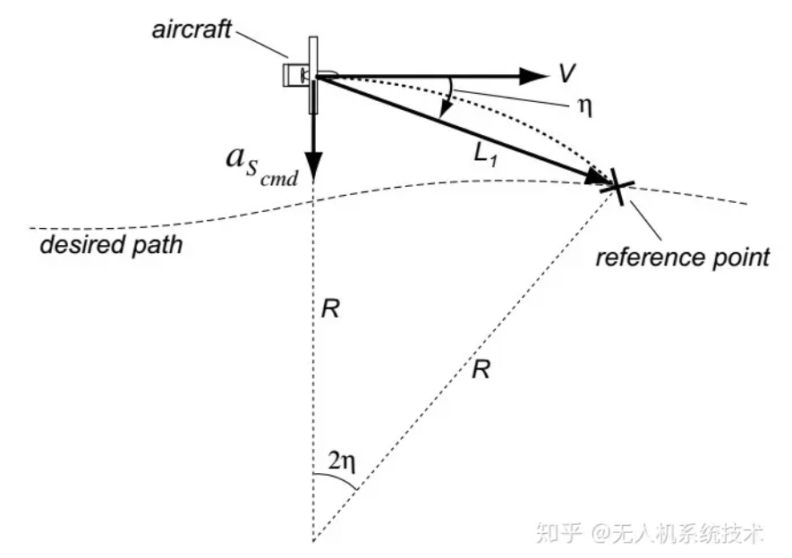
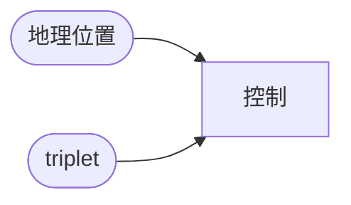
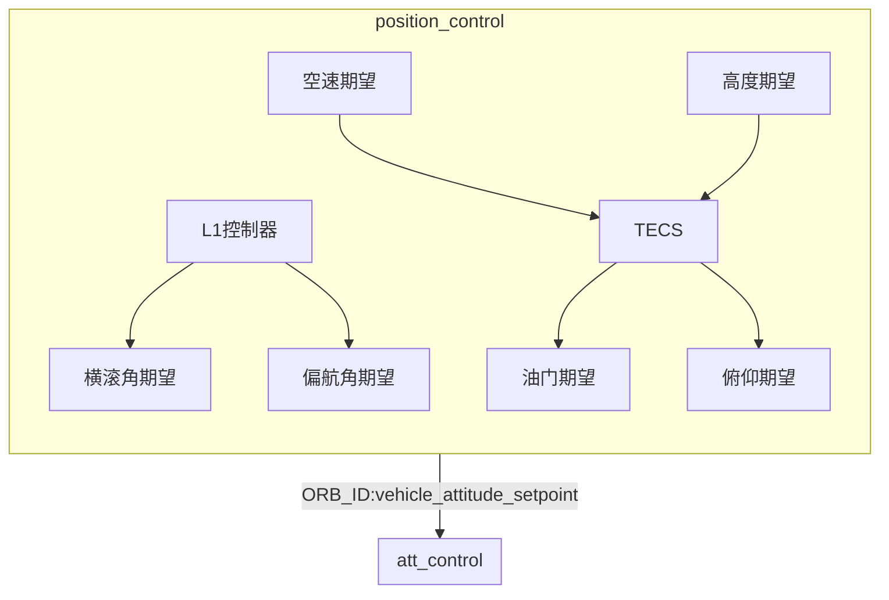

# 固定翼位置控制（L1制导率）

## 介绍

​		L1控制算法用来实现固定翼的轨迹飞行控制。L1算法就是给出无人机期望飞行路径上选取参考航点，并根据飞行地速计算出无人机侧向加速进而求出需要的横滚角以及偏航角期望。

## 原理

​		L1控制是根据无人机当前位置和期望位置，计算一个L1线段和绕圆圆心，根据当前速度计算出侧向加速度（也可以理解为绕圆的向心加速度），从而得到横滚角期望与偏航角期望。

### 论文

[1] S. Park, J. Deyst, and J. P. How, "A New Nonlinear Guidance Logic for Trajectory Tracking," *    Proceedings of the AIAA Guidance, Navigation and Control *    Conference, Aug 2004. AIAA-2004-4900.

[2] Paul Riseborough, Brandon Jones and Andrew Tridgell, L1 control for APM. Aug 2013.

### 建模

#### 公式推导

​		无人机向心力由飞行速度、转弯半径决定，表示如下图：

$$
a=\frac{V^2}{R}=\frac{V^2}{L_1/(2*sin(\eta))}=2\frac{V^2}{L_1}sin(\eta)
$$
其中：

- $V$：地速
- $L_1$：无人机当前位置到参考位置距离
- $\eta$：无人机当前速度与L1连线的夹角

​		故要获取向心加速度，就需要得到无人机地速$V$、到参考点距离$L_1$、角度$\eta$。

##### 横滚角期望

​		无人机通过调整横滚角实现转弯，而横滚角与转弯向心力严格对应，也就是通过向心力获取横滚角。

​		无人机在转弯过程中，升力抵消了离心力和重力的合力，故表示如下图：

​		根据向心加速度与重力加速度可以得到横滚角，公式如下：
$$
\phi=\frac{a}{g}
$$
这里：

$a$表示向心加速度（也就是无人机侧向加速度）；

$g$表示重力加速度；

##### 偏航角期望

​		偏航角期望就是当前速度与L1连线的夹角。
$$
\Psi=\eta
$$

#### 计算侧向加速度

##### 获取地速

​		通过传感器即可获取无人机地速。

##### 获取参考距离

$$
L_1=\frac{1}{\pi}\xi \cdot T\cdot V
$$

其中：

- $\xi$：L1 阻尼（damping）。
- T：L1 周期（period）。

> 在PX4中，通过参数FW_L1_DAMPING表示阻尼，在PX4中通过参数FW_L1_PERIOD表示周期。
>
> 并定义L1_ratio=1/pi\*damp\*period，初始值为5。则L1=L1_ratio*V，也就是如果当前速度为20，则L1=100m。
>

##### 获取角度

​		根据式即可获取横滚角。

### 引导方式

​		在实际飞行中，无人机引导轨迹包括三种类型：

- 航线：即无人机需要沿着特点航线（任务模式）飞行；
- 圆周轨迹：即无人机需要绕点盘旋（盘旋模式）；
- 定向轨迹：即无人机只需要保持一个航向即可；

​		飞控根据当前模式、飞行状态等进行判断，选择一种引导方式进行控制并计算得到机体的横滚、偏航期望。

#### 航线引导

​		设P为无人机当前位置，A点为上一个期望航点，B为当前期望航点。

##### 情况1

​		如果P点距离A较远（＞L1）且P点在A点后面（$\angle PAB$ > ±135°），则无人机应该直接朝着A点飞。如下图所示：

- 横滚角期望：根据$\eta$计算$L1$，并根据式计算横滚角；
- 偏航角期望：即向量PA的方向。

##### 情况2

​		如果无人机飞过了B点（∠PBC＜100°），则应该朝着B点飞。如下图所示：

- 横滚角期望：根据$\eta$计算$L1$，并根据式计算横滚角；
- 偏航角期望：即向量PB的方向。

##### 情况3

​		如果无人机在A和B点之间，则应该飞向AB连线。如下图所示：

​		这时$\eta=\eta_1+\eta_2$。

​		故可以计算向心加速度：
$$
a=2\frac{V^2}{L_1}sin(\eta)=2\frac{V^2}{L_1}(\eta_1+\eta_2)=2\frac{V^2}{L_1}(\frac{d}{L_1}+\frac{\dot{d}}{V})
$$

- 横滚角期望：根据$\eta$计算$L1$，并根据式计算横滚角；
- 偏航角期望：即向量AB的方向。

#### 圆周引导

#### 航向引导

local位置有效才进行固定翼位置控制。

### 框架

## 调参

​		在PX4飞控中，L1对应的参数主要有两个：FW_L1_PERIOD和FW_L1_DAMPING。我们在飞行中主要调试FW_L1_PERIOD，当无人机转弯不够快时把此参数调小，直到飞机出现些许震荡后调大此参数2-3左右即可，至于FW_L1_DAMPING一般在0.65-0.85之间，每次调整0.05找到最好的飞行状态即可。

## 附录

### 向心加速度

在二维平面内，向心加速度关系如下：
$$
a = \frac{v^2}{r}=r\omega^2=\omega v
$$

### 点积

$$
a \cdot b = |a|\cdot|b|\cdot cos(\theta)
$$

### 航迹角

​		也就是无人机移动方向，可以使用cog(Course over ground)表示。根据地速计算得到
$$
cog=arctan2(vy, vx)
$$
