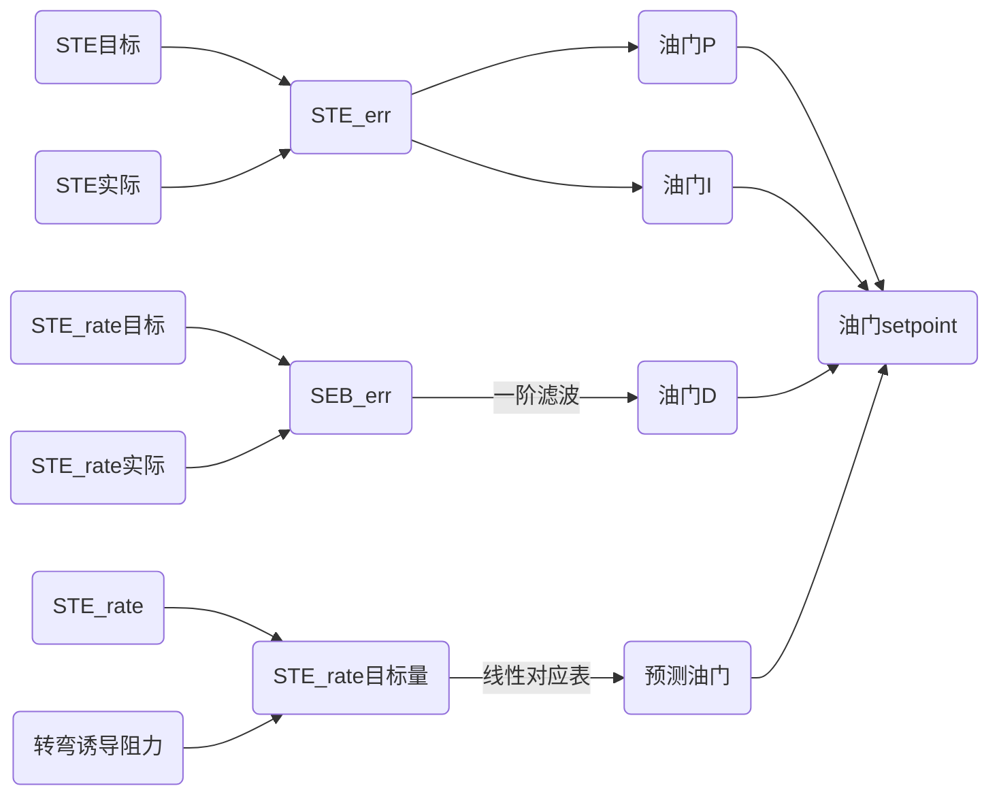
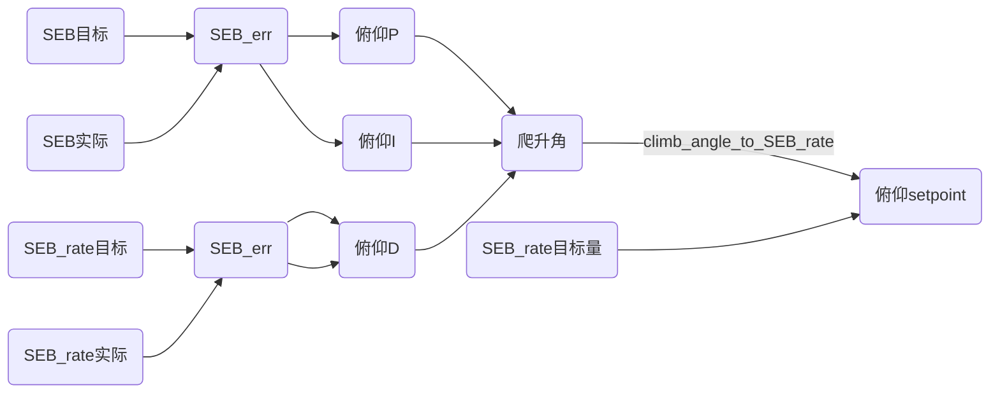

# 固定翼控制算法——总能量控制


tecs_update_pitch_throttle

TECS::update_pitch_throttle


## 简介

​		固定翼位置控制采用了总能量控制算法，总能量包括了无人机势能和无人机动能。通过测量高度和空速，就可以获取总能量。

​		总能量有如下特点：

- 要想总能量增加，则需要加大油门（通过做功增加能量）；

- 势能与动能可以互相转换，降低高度相当于动能增加、势能减小，增加高度相当于动能减小、势能增加；

- 通过俯仰角的调节，可以实现动能和势能的转换；

​		故使用油门就可以控制总能量，通过调节俯仰角就可以平衡动能和势能。也就是说可以通过总能量需求来计算期望的油门量，通过总能量平衡需求来计算期望的俯仰角。

​		

输入：无人机可测量量，包括高度、真空速

处理：根据高度和空速计算总能量、能量平衡

输出：油门期望、俯仰期望


## 理论公式

### 总能量计算

总能量由势能加动能组成：
$$
E_T=\frac{1}{2}m{V_T}^2+mgh
$$
其中：

- 真空速TAS：$V_T$
- 无人机质量：$m$
- 高度：$h$

求总能量变化率：
$$
\dot{E_T}=\frac{dE}{dt}=mV_T\dot{V_T}+mg\dot{h}
$$
质量归一化，认为$mg=1$，两边同除以$mg$后有
$$
\dot{E_T}=\frac{V_T\dot{V_T}}{g}+\dot{h}
$$
两边除以速度后有：
$$
\frac{\dot{E_T}}{V_T}=\frac{\dot{V_T}}{g}+\frac{\dot{h}}{V_T}=\frac{\dot{V_T}}{g}+sin(\gamma)
$$
其中$\gamma$是飞行计划角度（flight plan angle），可以认为表示“俯仰”。

根据飞机的动力学方程，我们有以下关系：
$$
T-D=mg(\frac{\dot{V_T}}{g}+sin(\gamma))
$$
其中T和D是推力和阻力，在水平飞行中，初始推力会根据阻力进行微调，推力的变化会导致：
$$
\Delta T=mg(\frac{\dot{V_T}}{g}+sin(\gamma))
$$
也就是说，$\Delta T$正比于$\dot{E}$，故无人机的推力设置值用于总能量控制。

当$\gamma$很小时，有：
$$
sin(\gamma)\approx\gamma
$$


### 能量平衡

对升降舵（俯仰）的控制是能量守恒的，因此用来交换动力能源，反之亦然。控制升降舵使无人机低头（俯冲）可以将势能转换为动能，反正将动能转换为势能。 

能量平衡率定义为：
$$
\dot{B}=\gamma-\frac{\dot{V_T}}{g}
$$


### 油门控制

18675539815


### 俯仰控制


## PX4控制

### 简介


在PX4中，总动能计算如下：
$$
STE=SKE+SPE=
0.5*V_{TAS}*V_{TAS}
+
g*H
$$
其中$V_{TAS}$是真空速，$H$为高度。

总能量变化率：
$$
E_{rate}=V_{TAS}*V_{rate}+g*V_z
$$
其中$V_{rate}$为真空速变化率，$V_z$为高度变化率。

### 油门控制




### 升降控制

​		PX4将动能和重力势能的分配叫Energy Balance，有一个分配相关的重要参数能量分配权重W，W可在0到2之间变化，公式如下：

​		$SEB = W*动能+（2-W)*势能$

​		即当W=0时，放弃速度控制，只控制高度，W=2时，放弃高度控制只控制速度，W=1时，既控制速度也控制高度，二者的权重是1：1。




## 源码分析

### 主要函数成员变量

#### _SPE_estimate

无人机当前势能。specific potential energy estimate。

#### _SKE_estimate

无人机当前动能。

#### _SPE_rate

势能变化率，即一阶导数。specific potential energy rate estimate (m**2/sec**3)

#### _SKE_rate

动能变化率，即一阶导数。


#### _SPE_setpoint

无人机势能需求。specific potential energy demand (m^2/sec^2)。

#### _hgt_setpoint

期望高度，通过气压计进行初始化。

由updateHeightRateSetpoint()函数和_update_height_rate_setpoint()函数更改。

#### _hgt_rate_setpoint

期望天向速度。

由updateHeightRateSetpoint()函数和_update_height_rate_setpoint()函数更改。

### 函数讲解

#### _update_energy_estimates

更新能量估计。当前势能、动能、总能量、期望势能、期望动能、期望总能量，以及能量差。

**无人机势能**

在物理学中，势能计算公式为$E=m*h*g$，在代码中，质量$m$可以通过归一化后不再考虑。无人机势能即：
$$
SPE=h*g
$$
**无人机动能**

在物理学中，动能计算公式为$E=\frac{1}{2}*m*v^2$，在代码中，质量$m$可以通过归一化后不再考虑。无人机动能即：
$$
SKE=\frac{1}{2}*v^2
$$
故能量的单位是$m^2/s^2$。


#### _update_throttle_setpoint

根据总能量需求计算期望油门。


#### _update_pitch_setpoint

根据能量平衡需求计算期望俯仰角。


#### update_pitch_throttle

- hgt_rate_sp：设置期望天向速度（爬升/下降率），默认值NAN；

  如果指定期望天向速度，则使用最大爬升率和最大下降率参数对其进行限幅；如果没有指定，则根据高度计算；


```c++
if (rt_isfinite(hgt_rate_sp)) {
    // 如果指定期望天向速度，则使用最大爬升率和最大下降率参数对其进行限幅
    // use the provided height rate setpoint instead of the height setpoint
    _update_height_rate_setpoint(hgt_rate_sp);
} else {
    // 若没有指定，则根据高度计算
    // calculate heigh rate setpoint based on altitude demand
    updateHeightRateSetpoint(hgt_setpoint, target_climbrate, target_sinkrate, baro_altitude);
}
```


_update_height_rate_setpoint


#### updateHeightRateSetpoint

更新期望高度以及期望天向速度。

默认情况下，没有指定期望天向速度时，则根据高度计算出期望天向速度。

## 附录

### 术语

#### flight plan angle

飞行路径角，将速度矢量分解为垂直位置矢量分量和平行位置矢量分量，飞行路径角就是速度矢量和垂直位置矢量分量夹角

#### TAS

TAS是True airspeed的缩写，即真空速。