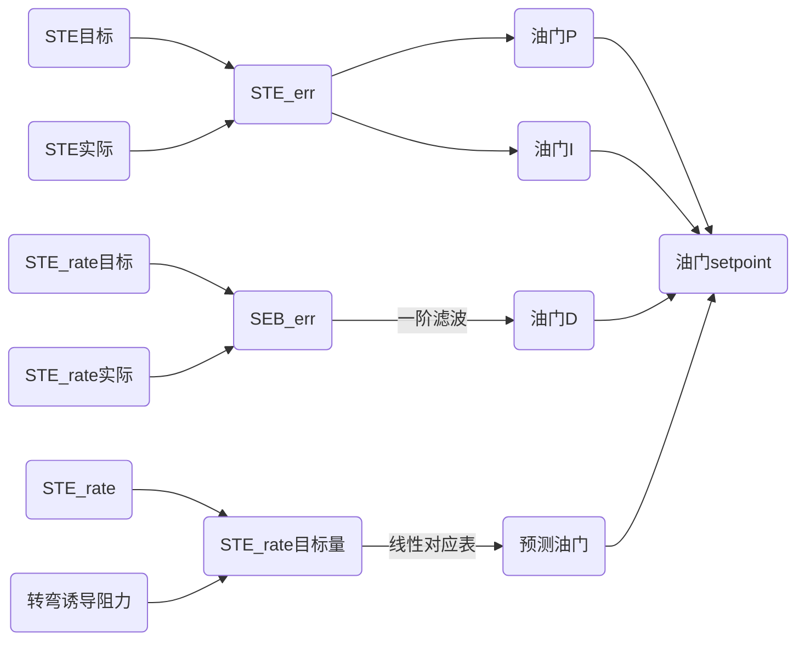
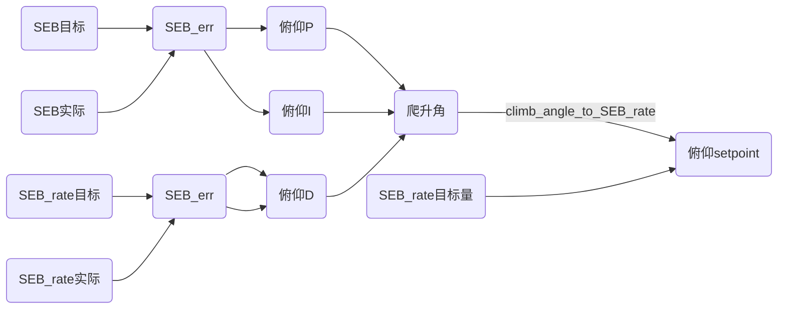

# 固定翼控制算法——总能量控制

## 简介

​		固定翼位置控制采用了总能量控制算法，总能量包括了无人机势能和无人机动能。通过测量高度和空速，就可以获取总能量。

​		总能量有如下特点：

- 要想总能量增加，则需要加大油门（通过做功增加能量）；

- 势能与动能可以互相转换，降低高度相当于动能增加、势能减小，增加高度相当于动能减小、势能增加；

- 通过俯仰角的调节，可以实现动能和势能的转换；

​		故使用油门就可以控制总能量，通过调节俯仰角就可以平衡动能和势能。也就是说可以通过总能量需求来计算期望的油门量，通过总能量平衡需求来计算期望的俯仰角。

​		

输入：无人机可测量量，包括高度、真空速

处理：根据高度和空速计算总能量、能量平衡

输出：油门期望、俯仰期望

## 理论公式

$$
x+y=a\\
x-y=b
$$

通过计算总能量期望，获取油门期望；

通过计算能量平衡期望，获取俯仰角期望；

### 总能量计算

总能量由势能加动能组成：
$$
E_T=mgh+\frac{1}{2}m{V_T}^2
$$
其中：

- 真空速TAS：$V_T$
- 无人机质量：$m$
- 高度：$h$

求总能量变化率：
$$
\dot{E_T}=\frac{dE}{dt}=mg\dot{h}+mV_T\dot{V_T}
$$
质量归一化，认为$mg=1$，两边同除以$mg$后有
$$
\dot{E_T}=\dot{h}+\frac{V_T\dot{V_T}}{g}
$$
两边除以速度后有：
$$
\frac{\dot{E_T}}{V_T}=\frac{\dot{h}}{V_T}+\frac{\dot{V_T}}{g}=sin(\gamma)+\frac{\dot{V_T}}{g}
$$
其中$\gamma$是飞行计划角度（flight plan angle），可以认为表示“俯仰”。

根据飞机的动力学方程，我们有以下关系：
$$
T-D=mg(sin(\gamma)+\frac{\dot{V_T}}{g})
$$
其中T和D是推力和阻力，在水平飞行中，初始推力会根据阻力进行微调，推力的变化会导致：
$$
\Delta T=mg(sin(\gamma)+\frac{\dot{V_T}}{g})
$$
也就是说，$\Delta T$正比于$\dot{E}$，故无人机的推力设置值用于总能量控制。

当$\gamma$很小时，有：
$$
sin(\gamma)\approx\gamma
$$

### 能量平衡

对升降舵（俯仰）的控制是能量守恒的，因此用来交换动力能源，反之亦然。控制升降舵使无人机低头（俯冲）可以将势能转换为动能，反正将动能转换为势能。 

能量平衡定义为势能能力-动能能量，即：
$$
B=mgh-\frac{1}{2}m{V_T}^2
$$
两边求导，得到能量平衡变化率：
$$
\dot{B}=mg\dot{h}-mV_T\dot{V_T}
$$

能量平衡变化率定义为：
$$
\dot{B}=\gamma-\frac{\dot{V_T}}{g}
$$

若保持油门不变（也就是总能量不变）当无人机有一定俯仰角时（例如俯仰角为正），产生高度变化率$\dot{h}$，同时无人机速度会下降。

故根据上图可知，短时间内可认为高度变化率（垂直速度）可由俯仰角和无人机速度得到：
$$
\dot{h}=V_T=V*sin(\gamma)\\
$$
无人机速度变化率（加速度）可根据俯仰角和重量加速度计算，故有：
$$
\dot{V}=g*sin(\gamma)
$$
本质上，改变俯仰角后，势能与动能互相转化，短时间内势能变化率和动能变化率肯定是绝对值相等而符号相反。

势能与动能的转换关系通过公式表示如下：
$$
mg\dot{h}=m*g*V*sin(\gamma)=\\
m*V*g*sin(\gamma)=
m*V*\dot{V}
$$
从上式可以看到，势能转化为了动能。

### 油门控制

​		对固定翼来说，发动机是一个做功设备，油门对应的是功率（即总能量变化率），油门越高、时间越久，总能量增加越多。

​		也就是，如果希望飞的更高，高度就要增加，势能变化率＞0，总能量变化率>0，那么油门就要增加；同样，如果希望飞的更快，速度就要增加，动能变化率>0，那么油门也要增加。

### 俯仰控制

​		对固定翼来说，

也就是，如果希望高度增加（势能变化率>0），速度不变（动能变化率=0），能量分配变化率>0，期望俯仰角则>0；

如果希望高度不变（势能变化率=0），速度减小（动能变化率<0），能量分配变化率>0，期望俯仰角则>0，速度的减小其实会通过增加油门的方式实现；

### 控制逻辑

|                    | 总能量变化率 | 能量分配变化率 | 油门 | 俯仰 |
| ------------------ | ------------ | -------------- | ---- | ---- |
| 高度增加，速度不变 | >0           | >0             | 增加 | 增加 |
| 高度减小，速度不变 | <0           | <0             | 减小 | 减小 |
| 高度不变，速度增加 | >0           | <0             | 增加 | 不变 |
| 高度不变，速度减小 | <0           | >0             | 增加 | 不变 |

## PX4控制

### 简介

#### 总能量计算

在PX4中，总能量计算如下：
$$
STE=SKE+SPE=
0.5*V_{TAS}*V_{TAS}
+
g*H
$$
其中$V_{TAS}$是真空速，$H$为海拔高度。

总能量变化率：
$$
E_{rate}=V_{TAS}*V_{rate}+g*V_z
$$
其中$V_{rate}$为真空速变化率，$V_z$为高度变化率。

#### 平衡能量计算

​		平衡能量就是势能与动能的差，为了能够根据场景需求，增加了高度（势能）比重$W_h$和速度（动能）比重$W_v$，平衡能量计算考虑了比重，如下：
$$
SEB=SPE*W_h-SKE*W_v
$$

### 油门控制

总能量误差

​		总能量误差为势能误差与动能误差之和。
$$
STE_{err}=SPE_{sp}-SPE_{est}+SKE_{sp}-SKE_{est}
$$
能量平衡误差

​		能量平衡误差为能量平衡期望与能量平衡做差。
$$
SEB_{err}=\\(SPE_{sp}*SPE_{weight}-SKE_{sp}*SKE_{weight})-\\
(SPE_{est}*SPE_{weight}-SKE_{est}*SKE_{weight})
$$

### 俯仰控制

​		PX4将动能和重力势能的分配叫Energy Balance，有一个分配相关的重要参数能量分配权重W，W可在0到2之间变化，公式如下：

​		$SEB = W*动能+（2-W)*势能$

​		即当W=0时，放弃速度控制，只控制高度，W=2时，放弃高度控制只控制速度，W=1时，既控制速度也控制高度，二者的权重是1：1。

## 附录

### 术语

#### flight plan angle

飞行路径角，将速度矢量分解为垂直位置矢量分量和平行位置矢量分量，飞行路径角就是速度矢量和垂直位置矢量分量夹角

#### IAS

指示空速，即表速，由空速计动压静压进行计算。

#### TAS

TAS是True airspeed的缩写，即真空速，无人机相对空气的速度。

#### EAS

当量空速，低速情况下与IAS相同。

