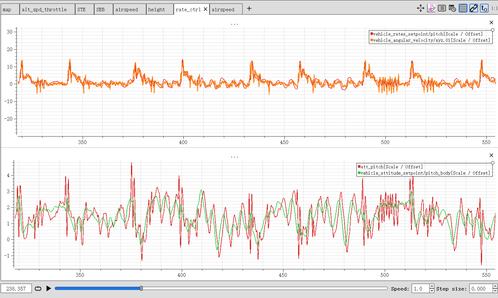

# 固定翼调参

## 基本调参

### 基本参数设置

设置一个基本的飞行参数，主要包括：

- 巡航速度：
- 失速速度：
- 最大油门：
- 最小油门：

### 飞行测试

- FW_T_CLMB_MAX：最大爬升速度，油门最大时保持巡航速度条件下能达到的最大爬升速度。可以在盘旋模式、指点飞行模式下给定一个较大的高度差，让无人机一直爬升，如果巡航速度保持不变，油门未达到最大油门，那么就可以增加FW_T_CLMB_MAX，如果已经达到最大油门而无人机速度降低了，则减小FW_T_CLMB_MAX。
- FW_T_SINK_MIN：最小下沉速度，油门最小时保持巡航速度条件下能达到的最大下沉速度。

## 固定翼姿态控制调参

由于横滚调试较为安全一些，故一般先调横滚，再调俯仰。

## 总能量调参

飞行一圈后，根据日志分析，修改参数。

### 巡航油门-FW_THR_CRUISE

应该是巡航速度下的平均油门量，可以对应于日志中`actuator_control_1.control.03`消息。

可以根据油门曲线评估一个初步的油门量，再根据曲线特性进行调整。

例如上图油门大部分保持在0.55，然而油门会出现时不时往下走的情况，说明默认油门可能高了，可以调整小一些。例如调整为0.3后，油门波动范围就能够接受了。

> 正常来讲油门应该在默认油门的上下波动，但如果有固定偏差，会通过积分项进行修正。

## 参数汇总

### 内环

| 参数    | 说明                                                         | 备注 |
| ------- | ------------------------------------------------------------ | ---- |
| FW_R_TC | 横滚角时间常数，相当于固定翼角度外环P参数，横滚角到角速率的P增益=1/FW_R_TC，默认0.4 |      |
| FW_P_TC |                                                              |      |
|         |                                                              |      |

### TECS

| 参数            | 说明                                                         | 备注                                 |
| --------------- | ------------------------------------------------------------ | ------------------------------------ |
| FW_THR_CRUISE   | 巡航油门 计算期望油门的第一步就是是基于巡航油门           | 巡航速度下的油门值，通过飞行数据估计 |
| FW_THR_MIN      | 最小油门                                                     | 用于计算预测油门量，限制期望油门     |
| FW_THR_MAX      | 最大油门                                                     | 用于计算预测油门量，限制期望油门     |
| FW_THR_SLEW_MAX | 油门最大变化率（油门增长斜率），等同于油门从最小增加到最大的时间，在实际控制时，油门变化不能超过该变化率 |                                      |
| FW_PSP_OFF      | 俯仰设定配平值 Pitch setpoint offset (pitch at level flight) | 一般等于正常速度巡航时无人机俯仰角度 |
| FW_T_SPDWEIGHT  | 越大说明控制时速度比重越大，高度比重越小 speed<->height，默认为1 | 当没有空速计时，该值必须设置为0      |
|                 |                                                              |                                      |
| FW_T_THR_DAMP   | 总能量变化率误差到油门的P增益，默认0.1                       | 用于计算油门                         |
| FW_T_I_GAIN_THR | 总能量变化率误差到油门的I增益，默认0.3                       | 用于计算油门                         |
|                 |                                                              |                                      |
| FW_T_PTCH_DAMP  | 平衡能量变化率误差到俯仰的P增益，默认0.1                     |                                      |
| FW_T_I_GAIN_PIT | 平衡能量变化率误差到俯仰的I增益，默认0.1                     | 用于限制俯仰角                       |
| FW_T_VERT_ACC   | 垂直方向最大加速度，默认7m/s²                                | 用于限制俯仰角                       |
|                 |                                                              |                                      |
|                 |                                                              |                                      |
| FW_T_CLMB_MAX   | 油门最大时（THR_MAX），保持巡航速度前提下，无人机拉升过程中的垂直方向爬升速度 |                                      |
| FW_T_SINK_MIN   | 油门最小时（THR_MIN），保持巡航速度前提下，无人机俯冲过程中的垂直方向下沉速度 |                                      |
| FW_T_CLMB_R_SP  | 自动模式下（且没指定期望爬升速度时）无人机改变高度时的垂直方向默认下沉速度；手动模式下最大爬升速度 | 用于设置期望天向速度                 |
| FW_T_SINK_R_SP  | 自动模式下（且没指定期望爬升速度时）无人机改变高度时的垂直方向默认下沉速度；手动模式下最大下沉速度 | 用于设置期望天向速度                 |
|                 |                                                              |                                      |
| FW_T_ALT_TC     | 高度差到天向速度P增益，默认2                                 | 用于设置期望天向速度                 |
| FW_T_HRATE_FF   | 高度差到天向速度前馈增益，默认0.3                            | 用于设置期望天向速度                 |

## 常用机型参数

### 泡沫机（飞龙）

#### 固定翼相关参数

FW_PR_FF	1	0.4
FW_PR_I	1	0.12
FW_PR_IMAX	1	0.4
FW_PR_P	1	0.4
FW_PSP_OFF	1	0.0
FW_P_LIM_MAX	1	45.0
FW_P_LIM_MIN	1	-45.0
FW_P_RMAX_NEG	1	60.0
FW_P_RMAX_POS	1	60.0
FW_P_TC	1	0.4
FW_RLL_TO_YAW_FF	1	0.0
FW_RR_FF	1	0.5
FW_RR_I	1	0.12
FW_RR_IMAX	1	0.2
FW_RR_P	1	0.066
FW_R_LIM	1	30.0
FW_R_RMAX	1	70.0
FW_R_TC	1	0.4
FW_THR_ALT_SCL	1	0.0
FW_THR_CRUISE	1	0.3
FW_THR_IDLE	1	0.15
FW_THR_LND_MAX	1	1.0
FW_THR_MAX	1	1.0
FW_THR_MIN	1	0.0
FW_THR_SLEW_MAX	1	0.0

FW_T_ALT_TC	1	3.0
FW_T_CLMB_MAX	1	5.0
FW_T_CLMB_R_SP	1	3.0
FW_T_HRATE_FF	1	0.5
FW_T_I_GAIN_PIT	1	0.1
FW_T_I_GAIN_THR	1	0.3
FW_T_PTCH_DAMP	1	0.1
FW_T_RLL2THR	1	15.0
FW_T_SEB_R_FF	1	1.0
FW_T_SINK_MAX	1	5.0
FW_T_SINK_MIN	1	2.0
FW_T_SINK_R_SP	1	2.0
FW_T_SPDWEIGHT	1	1.0
FW_T_SPD_OMEGA	1	2.0
FW_T_STE_R_TC	1	0.4
FW_T_TAS_R_TC	1	0.2
FW_T_TAS_TC	1	5.0
FW_T_THR_DAMP	1	0.08
FW_T_VERT_ACC	1	7.0

#### 数据绘图

俯仰角控制

总能量

平能能量

空速控制

高度控制

油门控制

