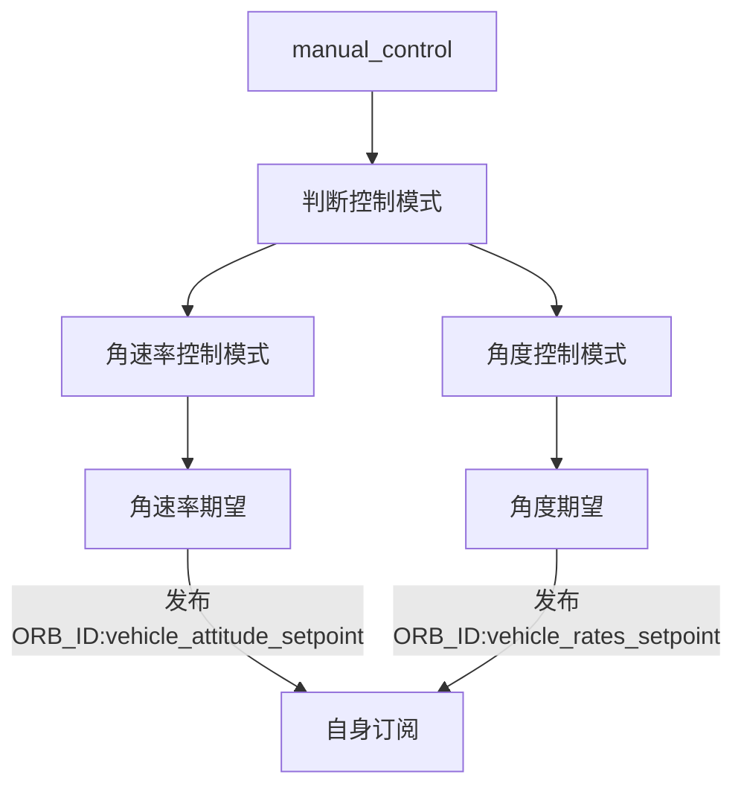

# 固定翼姿态控制

## 介绍

固定翼姿态控制模块主要包含了四个控制器：横滚角控制器、俯仰角控制器、偏航角控制器、前轮控制器。每个控制器都包括了角度控制以及角速度控制。

## 框架

### 输入输出

#### 输入

主要订阅主题如下：

- 姿态角：ORB_ID(vehicle_attitude)
- 角速度：ORB_ID(vehicle_angular_velocity)
- 姿态角期望：ORB_ID(vehicle_attitude_setpoint)
- 角速率期望：ORB_ID(vehicle_rates_setpoint)
- 手动控制：ORB_ID(manual_control_setpoint)
- 控制模式：ORB_ID(vehicle_control_mode)，由commander发布；

#### 输出

- 姿态角期望：ORB_ID(fw_virtual_attitude_setpoint)、ORB_ID(vehicle_attitude_setpoint)，如果是VTOL垂起机型则发布virtual主题；
- 驱动器：ORB_ID(actuator_controls_virtual_fw) ORB_ID(actuator_controls_0)，如果是VTOL垂起机型则发布virtual主题；
- 角速率期望：ORB_ID(vehicle_rates_setpoint)

姿态角期望来源有两种：

- 当时auto模式时如任务，姿态角由固定翼位置控制模块发布；
- 当是manual模式时（即由遥控器控制），姿态角由固定翼姿态控制模块发布，首先订阅ORB_ID(manual_control_setpoint)主题获取遥控指令输入，然后再发布ORB_ID(fw_virtual_attitude_setpoint)主题。

