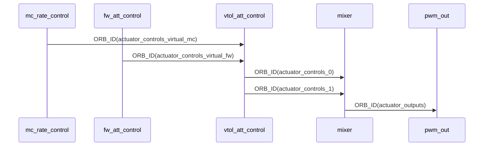

# VTOL


输出：

ORB_ID(actuator_controls_0)

ORB_ID(actuator_controls_1)

ORB_ID(vehicle_attitude_setpoint)

ORB_ID(vtol_vehicle_status)


对于垂起构型无人机，ORB消息流图如下所示：




## 后转换


### 返航过程

#### navigator处理

​		在`RTL::on_active()`函数中，调用`RTL::set_rtl_item()`用于设置返航航点，

1）判断返航状态是否为RTL_STATE_TRANSITION_TO_MC，如果是则调用MissionBlock::set_vtol_transition_item()

2）调用MissionBlock::issue_command()，将mission_item转成控制命令(vehicle_command)

3）发布`ORB_ID(vehicle_command)`主题，发送`NAV_CMD_DO_VTOL_TRANSITION(=3000)`命令，对应的command=3000，param1=vtol_vehicle_status_s::VEHICLE_VTOL_STATE_MC(=2)。


#### VTOL处理

在函数vtol_att_control::vehicle_cmd_poll()中订阅`ORB_ID(vehicle_command)`主题，判断command是否为`vehicle_command_s::VEHICLE_CMD_DO_VTOL_TRANSITION(=3000)`。

赋值_transition_command = cmd.param1。

#### 发动机处理

发动机订阅后`ORB_ID(vehicle_command)`主题，如果cmd.param1==VTOL_VEHICLE_STATUS_VEHICLE_VTOL_STATE_MC(=2)，则进行关闭处理。


#### 流程图

```flow
st=>start: 返航处理
RTL::on_active()
op1=>operation: 设置返航
RTL::set_rtl_item()
cond=>condition: 是否返航状态为
RTL_STATE_TRANSITION_TO_MC
op2=>operation: 设置mission_item为后转换
MissionBlock::set_vtol_transition_item()
mis_op1=>operation: 将mission_item转成控制命令(vehicle_command)
MissionBlock::issue_command()
nav_op1=>operation: 发布无人机控制命令
Navigator::publish_vehicle_cmd()
op4=>operation: 发动机订阅

vtol_1=>operation: 订阅无人机控制命令
vtol_att_control::vehicle_cmd_poll()
st()->op1()->cond
cond(yes)->op2()->mis_op1()->nav_op1()->op4()
nav_op1(right)->vtol_1()
```


### 期望俯仰角计算

通过函数`update_and_get_backtransition_pitch_sp()`计算俯仰角。


- ORB_ID(vtol_vehicle_status)

  由VTOL->commander

## 参数

| 参数         | 描述                                         | 备注              |
| ------------ | -------------------------------------------- | ----------------- |
| VT_B_DEC_MSS | 后转换过程中制动（减速）加速度               | back_trans_dec_sp |
| VT_B_DEC_FF  | 后转换过程中，制动加速度到期望俯仰角前馈增益 |                   |
| VT_B_DEC_I   | 后转换过程中，制动加速度到期望俯仰角积分增益 |                   |

