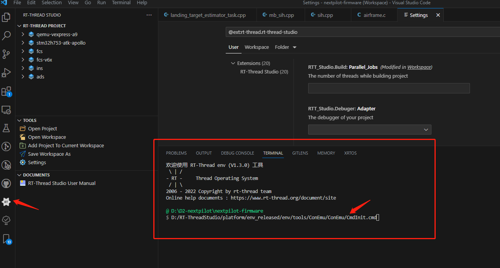

# 开发环境配置

## 软件安装

### 安装rt-thread studio

默认安装至D盘即可。

### 安装vscode


## 配置

### 打开项目

双击**nextpilot-firmware.code-workspace**使用vscode打开项目。

### 安装插件


## 编译

### 在vscode编译

点击rtthread插件，终端自动加载ENV环境。

> 通过↑箭头，可以查看rtthread插件在终端运行了命令：
>
> ```
> $ D:/RT-ThreadStudio/platform/env_released/env/tools/ConEmu/ConEmu/CmdInit.cmd 
> ```
>
> 这个命令启动了ENV环境。

启动后效果如下图所示：




>如果无法自动启动ENV环境，请先关闭所有RT-Thread Terminal：
>
>
>
>然后先点击一下qemu-vepress-a9工程，然后点击编译。
>
>
>
>


### 相关命令

- scons -j20：编译
- scons -c：清除编译
- qemu.bat：运行


## 仿真

### 网络

使用TAP，通过桥接。一定要确保计算机网线是连接的。

启动仿真后，过一会就能够使用`ifconfig`命令查看qemu仿真环境的IP配置了，并且可以通过ping连接局域网其他主机。

### 问题与解决

#### QEMU仿真启动后通信速率慢

1. 关闭所有杀毒软件
2. QEMU仿真启动窗口不要最小化，让其一直至于窗口最顶层
3. 设置网络，运行QEMU使用专用和公用网络。


## bootloader

将flash分段，前面128kb存放bootloader，固件从0x08020000（偏移128kb）开始。


我们将固件烧写到flash内，以0x08020000为起始地址。

在文件`target\cetcs\fcs-v4\board\linker_scripts\link.sct`中定义烧写地址。

```c
LR_IROM1 0x08020000 0x001E0000  {    ; load region size_region
  ER_IROM1 0x08020000 0x001E0000  {  ; load address = execution address
   *.o (RESET, +First)
   *(InRoot$$Sections)
   .ANY (+RO)
  }
  RW_IRAM1 0x24000000 0x00080000  {  ; RW data
   .ANY (+RW +ZI)
  }
}

```


在文件`target/cetcs/fcs-v4/board/board.c`中，定义程序从哪开始启动。

```c++
#include "board.h"

//#if defined(FLASH_APP_VTOR_OFFSET) && FLASH_APP_VTOR_OFFSET > 0
static int ota_app_vtor_reconfig(void) {
#define NVIC_VTOR_MASK 0x3FFFFF80
    /* Set the Vector Table base location by user application firmware definition */
    SCB->VTOR = 0x8000000 | (128 * 1024); // 即0x8020000地址。
    return 0;
}
INIT_BOARD_EXPORT(ota_app_vtor_reconfig);
//#endif // FLASH_APP_VTOR_OFFSET
```

